## 一、下载并安装VMware

## 二、下载Ubuntu镜像
可以从[Ubuntu官方下载界面](https://ubuntu.com/download/desktop)下载，也可以从[清华大学开源软件镜像站](https://mirrors.tuna.tsinghua.edu.cn/)等镜像站下载。此处以清华源为例。

### 1.打开清华大学开源软件镜像站
[https://mirrors.tuna.tsinghua.edu.cn/](https://mirrors.tuna.tsinghua.edu.cn/)

### 2.在搜索框搜索`ubuntu`，并点击`ubuntu-releases`

### 3.找到镜像文件(后缀为'.iso')，并下载
这里我们下载此时最新的`24.10`版本，其他版本与下面步骤类似。
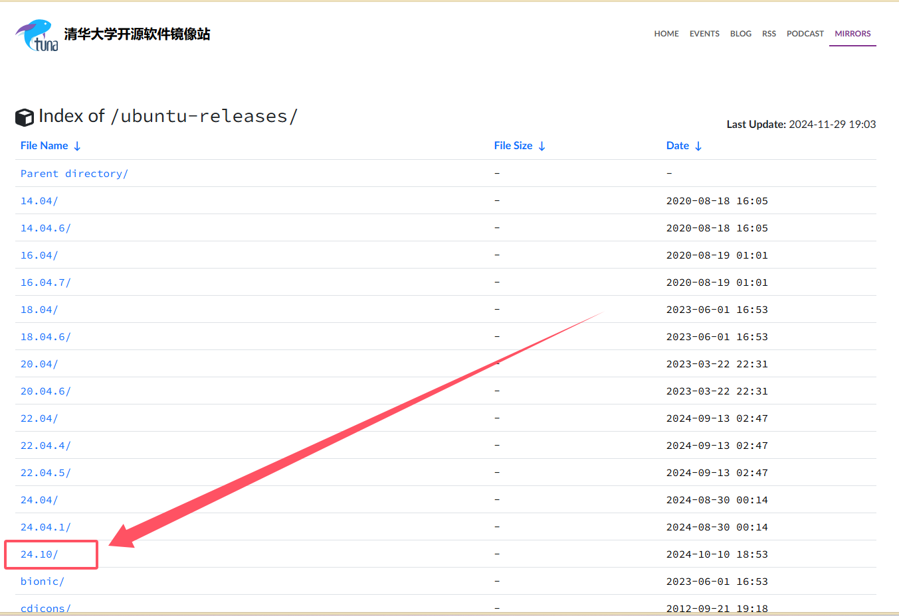
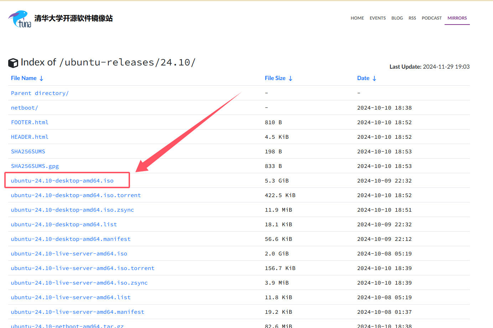

### 4.静静等待下载完成
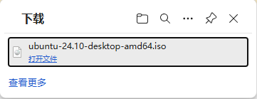
## 三、安装Ubuntu

### 1.打开安装好的`VMware Workstation Pro`，并点击`创建新的虚拟机`

### 2.选择配置`自定义(高级)`，并点击`下一步`
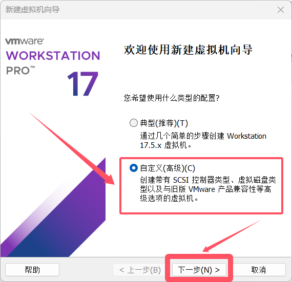
### 3.选择`Workstation 17.5.x`，并点击`下一步`
这里的`Workstation 17.5.x`是VMware的版本，如果版本不同或者没有这个版本，选择最新的版本应该都没问题。
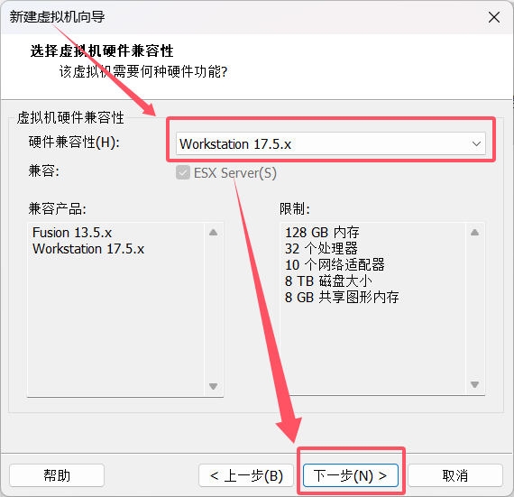

### 4.选择`安装程序光盘映像文件`，点击`浏览`，选择之前下载的`ubuntu-xx.xx.xx-desktop-amd64.iso`镜像文件，并点击`下一步`

注意，此时我的Ubuntu版本被检测到了，`将使用简易安装`。
### 5.个性化 Linux
- 全名：`sky9464`(主机名，随便填)
- 用户名：`sky9464`(登录时使用的用户名，此时不能填root，否则会出现[以下报错](#root-error))
- 密码：`123456`(随便填，这里是为了好记)
- 确认：`123456`(与密码相同)

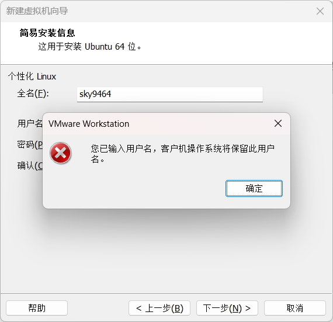

### 6.填写`虚拟机名称`,选择系统存放的`位置`，并点击`下一步`

### 7.配置`处理器数量`和`每个处理器的内核数量`，并点击`下一步`
如果这个Ubuntu是用来搭建一些环境的，建议适当调高`处理器数量`和`每个处理器的内核数量`。

### 8.配置`此虚拟机的内存`，并点击`下一步`
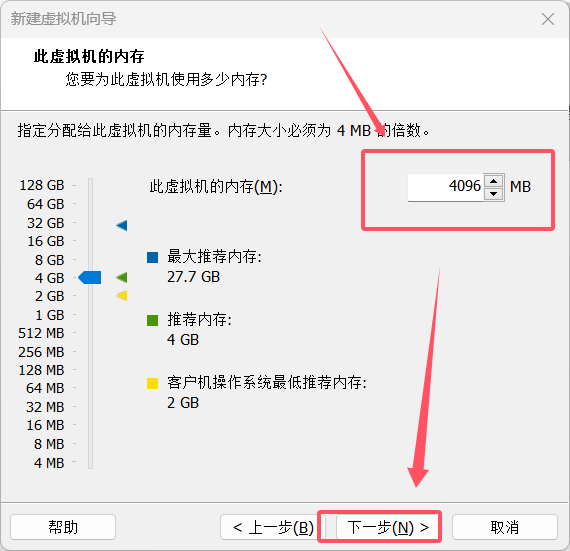
### 9.配置`网络连接`，并点击`下一步`
这里不详细解释各个连接类型，默认选择`使用桥接网络`即可。详解后续会出。

### 10.一直默认，点击`下一步`，直至`完成`
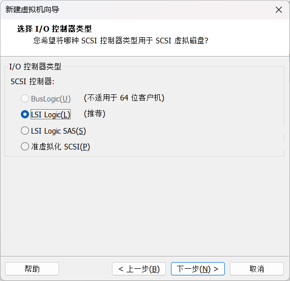
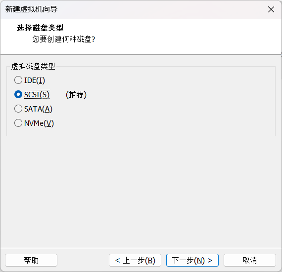
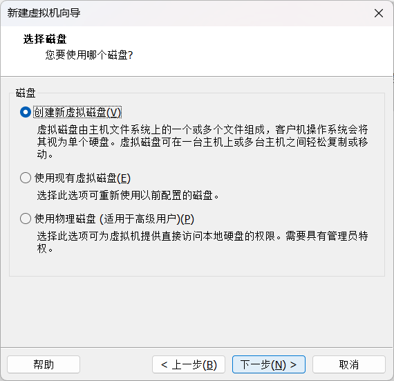

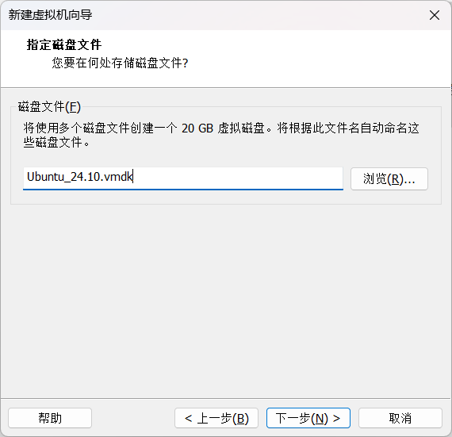
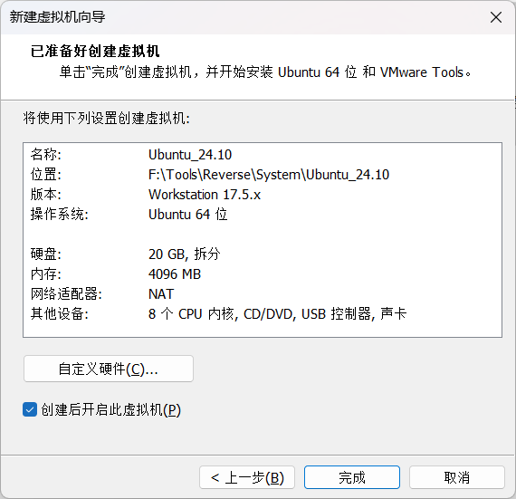
### 11.开启虚拟机中的Ubuntu
此步骤需上图中的`创建后开启此虚拟机`选项勾选之后点击`完成`，或者手动开启。
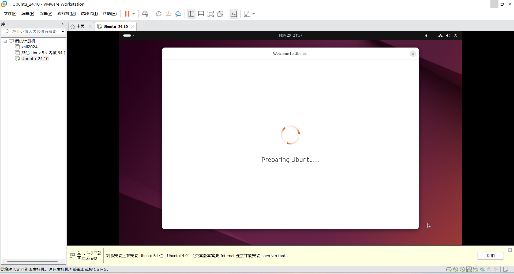

### 12.配置Ubuntu安装选项
一切配置和我下面的配置相同即可。(基本上都是默认配置)
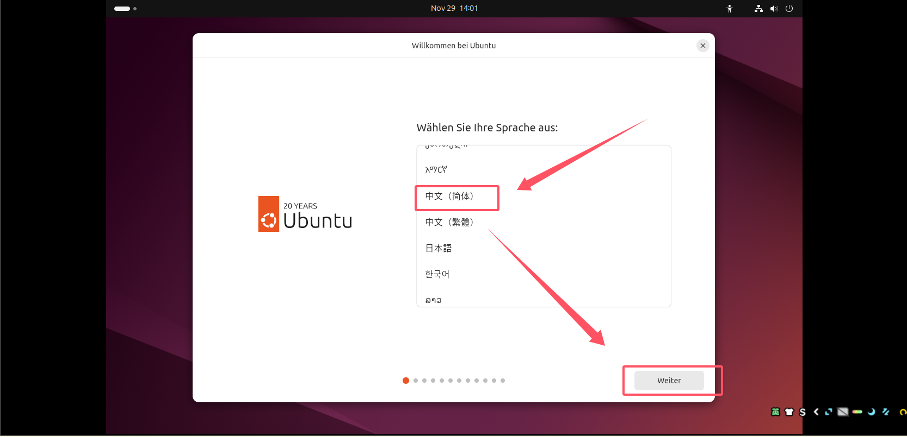

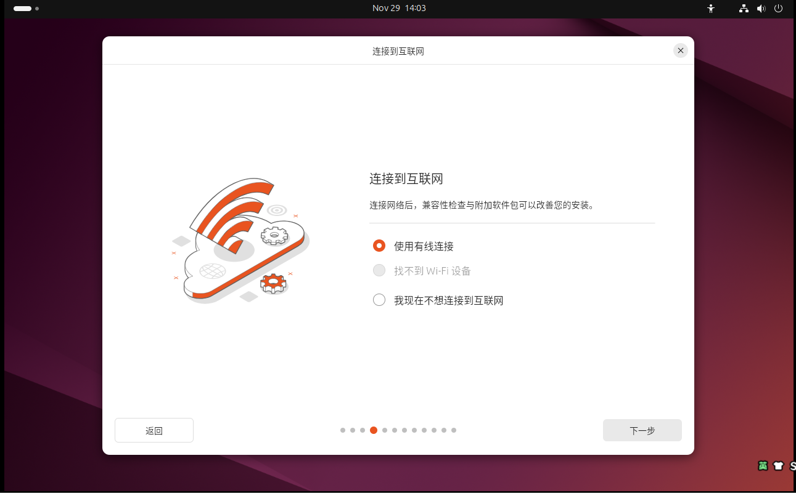

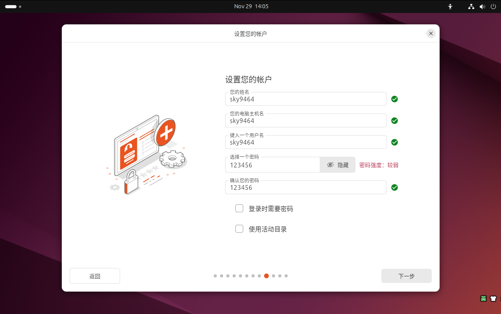

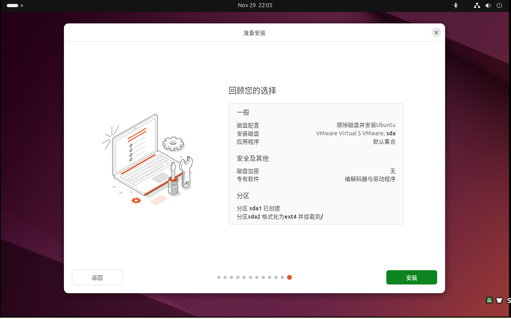

安装完成，点击`立即重启`即可。

接着进行一些简单的配置：
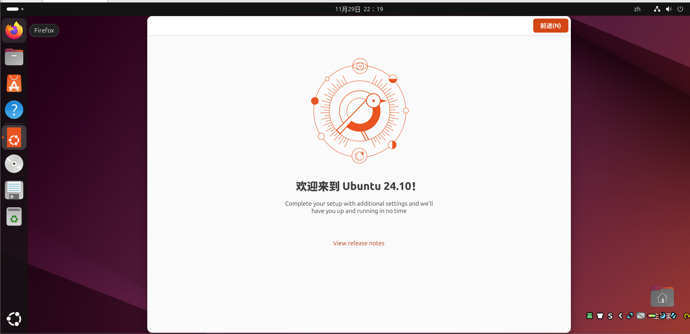

