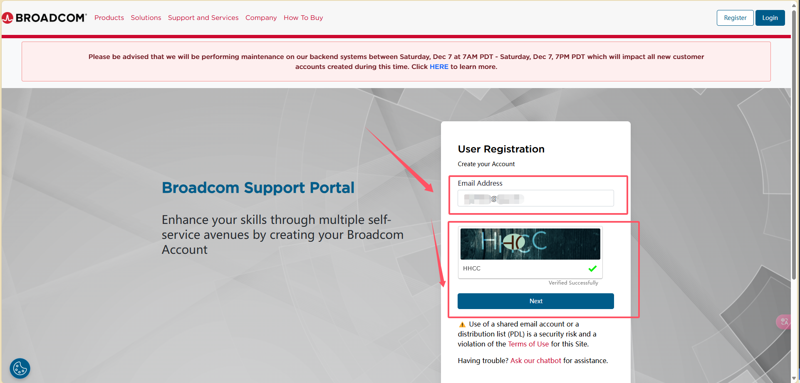
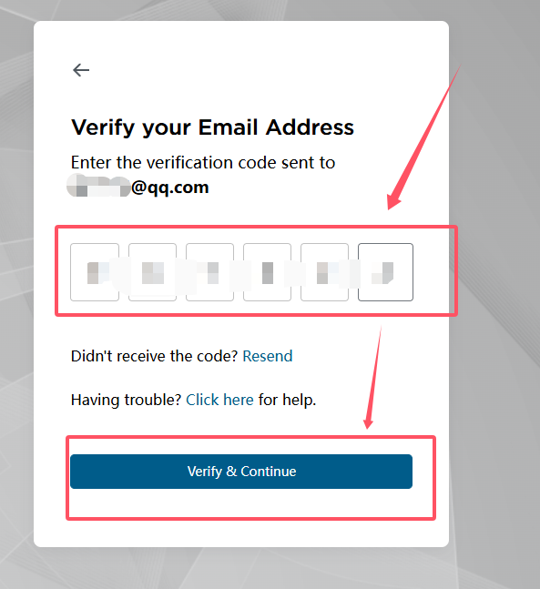
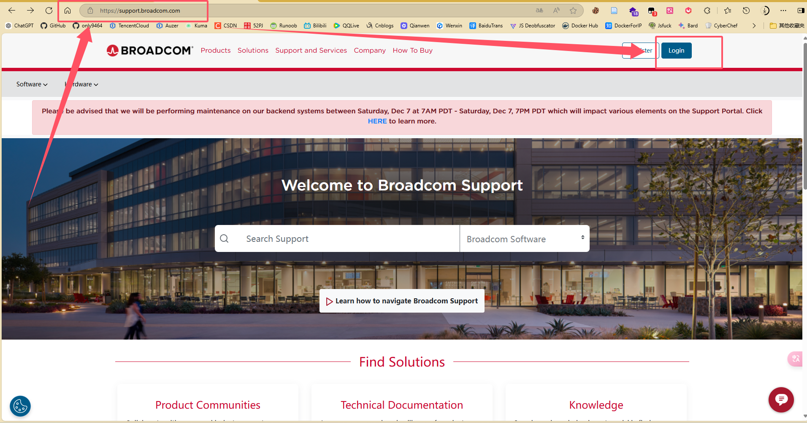

## 前言
截止到2024年12月2日，VMware现已完全免费(无论个人还是企业)。可以前往官网下载。下载介绍一下流程：

## 一、前往[Broadcom](https://profile.broadcom.com/web/registration)注册账号并登录
首先输入你的邮箱，然后点击`Next`

然后会跳转至[首页](https://support.broadcom.com/)，点击右上角的`Login`，输入你刚才的邮箱(就是你的用户名)和密码，然后点击`Sign In`

## 二、下载

不写了，看大佬的吧[https://www.cnblogs.com/EthanS/p/18211302](https://www.cnblogs.com/EthanS/p/18211302)
