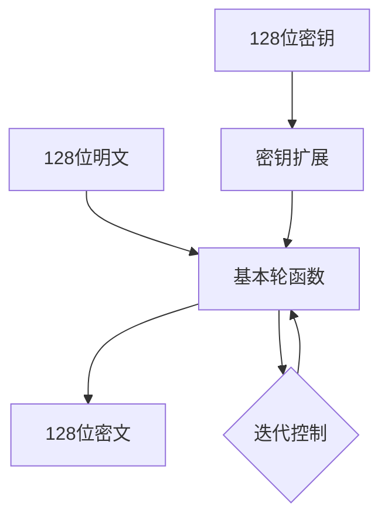
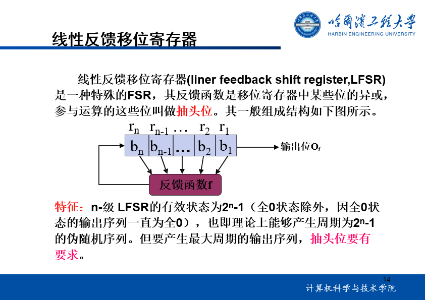
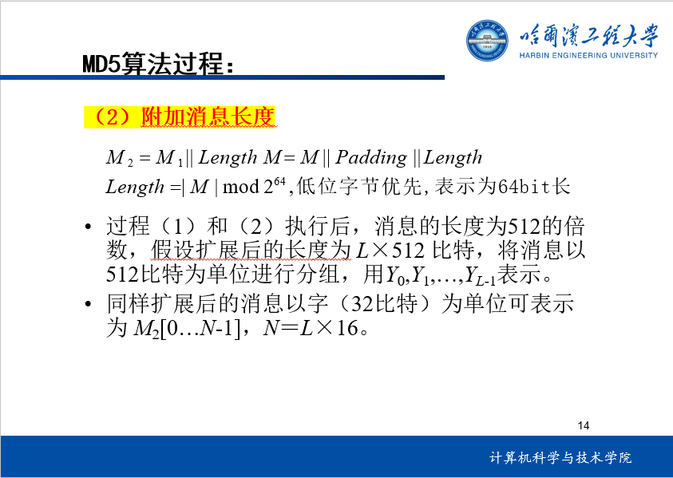
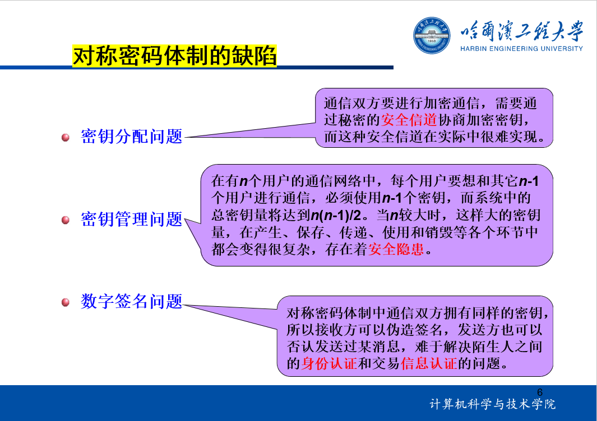
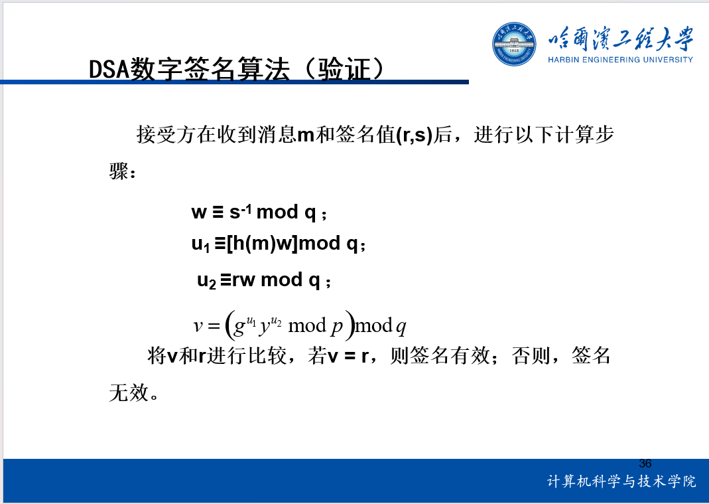
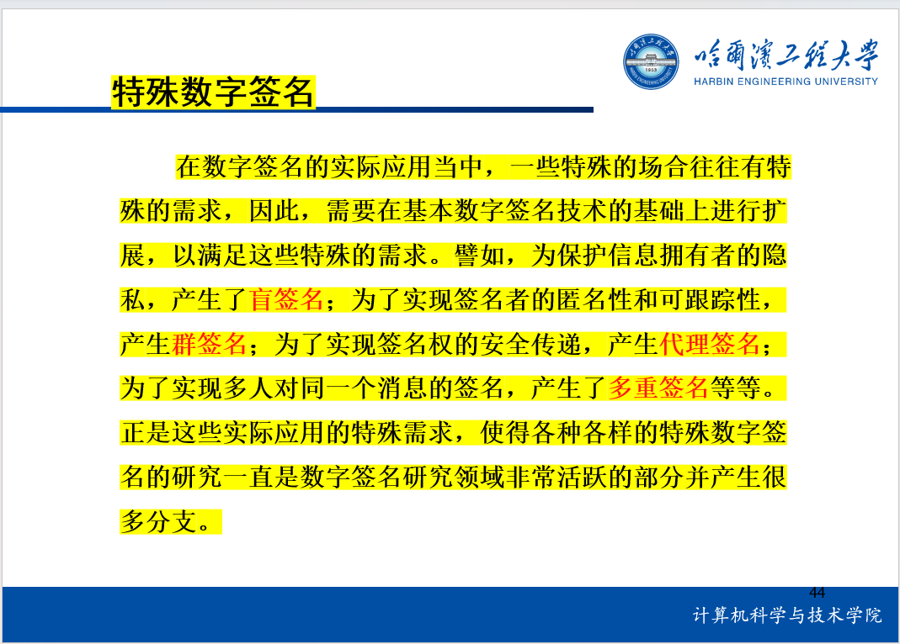

## 一、密码学概述

### 1.信息安全的六个属性

可用性、!!机密性!!、!!完整性!!、!!真实性!!、非否认性、可控性。

### 2.密码体制五元组(M, C, K, E, D)

- M: !!明文空间!!
- C: !!密文空间!!
- K: !!密钥空间（加密密钥、解密密钥）!!
- E: !!加密算法!!
- D: !!解密算法!!


### 3.安全模型

- !!唯密文攻击!!
- !!已知明文攻击!!
- !!选择明文攻击!!
- 自适应选择明文攻击
- !!选择密文攻击!!

### 4.密码体制

#### 柯克霍夫准则

密码体制的安全性完全寓于!!密钥!!之中。

## 二、古典密码学

### 1.置换密码
- 置换列密码
- 周期置换密码
### 2.代换密码
#### 单表代换密码
- 移位密码(凯撒密码)
- 仿射密码
- 替换密码
#### 多表代换密码
- 维吉尼亚密码
- Playfair密码
- 转轮密码
- 希尔密码
```mindmap
root((古典密码学))
    置换密码
        置换列密码
        周期置换密码
    代换密码
        单表代换密码
            移位密码(凯撒密码)
            仿射密码
            替换密码
        多表代换密码
            维吉尼亚密码
            Playfair密码
            转轮密码
            希尔密码
```
## 三、分组密码

设计思想：!!扩散!!、!!混淆!!

**操作模式：**

- !!电子密码本模式(ECB，Electronic Code Book)!!
- !!密码分组链接模式(CBC，Clipher Block  Chaining)!!
- !!密码反馈模式(CFB，Cipher Feedback)!!
- !!输出反馈模式(OFB，Output Feedback)!!

操作模式小结：
- ECB是最快、最简单的分组密码模式，但它的安全性最弱，一般不推荐使用ECB加密消息，但如果是加密随机数据，如 密钥，ECB则是最好的选择。
- CBC适合文件加密，而且有少量错误时不会造成同步失败，是软件加密的最好选择。
- CFB通常是加密字符序列所选择的模式，它也能容忍少量错误扩展，且具有同步恢复功能。
- OFB是在极易出错的环境中选用的模式，但需有高速同步机制。

### 1.DES密码算法

- 明文和密文为!!64位!!分组长度
- 密钥长度：!!56位!! , **但存在弱密钥，容易避开。**(!!64!!比特密钥中!!8!!比特为**校验位**)
- 采用**混乱**和**扩散**的组合，每个组合先!!替代!!后!!置换!!,共!!16!!轮

#### 密码模型
- Festel模型
#### 基本参数
- 分组长度：!!64比特!!
- 密钥长度：!!64比特!!
- 有效密钥长度：!!56比特!!
- 迭代圈数：!!16圈!!
- 每圈子密钥长度：!!48比特!!
#### 编码环节
- 6进4出的S盒变换
- 逐位模2加变换
- 比特移位变换P盒
- 比特移位变换E盒
- 比特抽取变换PC1、PC2和IP


### 2.AES密码算法
####  加密过程： **字节代换**、**行移位**、**列混淆**、**轮密钥加**
#### AES和DES不同之处
|               |            AES                   |              DES            | 
| :-----------: |         :-----------:            |         :-----------:       | 
|    密钥长度    | 128位、192位、256位(可变的)       |        56位(固定的)          | 
|    运算对象    |           面向字节                |           面向比特          | 
|   加解密运算   | 不一样，因而加密器不能同时用作解密器 |           无AES的限制       | 


### 3.SM4密码算法

#### 密码算法结构


## 四、序列密码（流密码）
**算法举例： RC4、A5**
### 1.线性反馈移位寄存器




### 2.非线性序列
（选择填空）
- Geffe序列生成器
- J-K触发器
- Pless生成器
- 门限发生器

## 五、密码学数论基础

### **1.欧拉定理**

- **欧拉函数**
设$m$是一个正整数，则$m$个整数$0,1,...,m-1$中与$m$互素的整数的个数，记为$\phi(m)$,称为欧拉函数。
**当$m$为素数时，$\phi(m)=m-1$**；**当$m$为[合数](https://baike.baidu.com/item/%E5%90%88%E6%95%B0/49186)时，$\phi(m)<m-1$。**

- **费马小定理**
设$m$是素数，$a$是任意整数，且$(a,m)=1$，则有$a^{m-1}\equiv 1(mod\ m)$。

- **欧拉定理**
设$m$是大于1的整数，$a$是与$m$互素的整数，则有$a^{\phi(m)}\equiv 1(mod\ m)$。

### **2.模重复平方计算法**
计算$b^n(\ mod\ m)$，其中$m$和$n$都是大整数。
#### ①将n写成二进制形式
$n$写成二进制形式：$n=n_0+n_1 2+n_2 2^2+...+n_{k-1} 2^{k-1}$
#### ②计算
$a=1$
$$
\begin{cases}
    a_0 = a·b^{n_0}(\ mod\ m),\ b_1=b^2(\ mod\ m)\\
    a_1 = a_0·b_1^{n_1}(\ mod\ m),\ b_2=b_1^2(\ mod\ m)\\
    \cdots\\
    a_{k-1} = a_{k-2}·b_{k-2}^{n_{k-1}}(\ mod\ m)
\end{cases}
$$
最终得到$a_{k-1}$,也就是结果：$b^n(\ mod\ m)$

### **3.☆中国剩余定理(CRT)(一次同余式组)☆**
设$m_1,m_2,...,m_k$是两两互素的正整数，$a_1,a_2,...,a_k$是任意整数，则同余式组
$$
\begin{cases}
    x\equiv a_1(\ mod\ m_1)\\
    x\equiv a_2(\ mod\ m_2)\\
    \cdots\\
    x\equiv a_k(\ mod\ m_k)
\end{cases}
$$
求解x的步骤：
- 1.计算$m=m_1m_2...m_k$
- 2.计算$M_i=m/m_i(i=1,2,...,k)$
- 3.计算$M_i$在模$m_i$意义下的逆元$M_i^{-1}$
- 4.计算$x=\sum_{i=1}^{k}a_iM_iM_i^{-1}(\ mod\ m)$


### **4. 整数的原根**
设 $m > 1$ 是整数，$a$ 是与 $m$ 互素的正整数，则使得
$$a^e \equiv 1 (\ mod\ m)$$
的最小正整数 $e$ 称为 $a$ 对模 $m$ 的指数（或阶），记作 $\text{ord}_m(a)$。如果 $a$对模 $m$ 的指数是 $\phi(m)$ ，则称 $a$ 为模 $m$ 的原根（或本原元）。

设$m >1$是整数，$a$是与$m$互素的整数，则整数$d$ 使得 $ad \equiv 1  (\ mod\ m)$ 成立的充要条件是$\text{ord}_m(a) | d$。

**推论1 设$m > 1$是整数，$a$ 是与$m$ 互素的整数，则 $\text{ord}_m(a) | \phi(m)$ 。**

**举例：5 模17的指数， $\text{ord}_{17}(5) = 16 = \phi(17)$，5是模17的原根。**
## 六、散列函数和消息认证
### **1.MD5算法**

#### **1.1 消息填充**

#### **1.2 附加消息长度**


#### **1.3 初始化链接向量**

#### **1.4 处理消息分组、输出结果**


## 七、公钥密码

**对称密码体制的缺陷、要求**：



**常见算法**：
- 背包问题（!!NP问题、背包算法!!）
- 基于大整数素因子分解问题(!!RSA!!)
- 基于有限域乘法群上的离散对数问题(!!ElGamal!!)
- 椭圆曲线的离散对数问题(ECC)
- 基于身份、属性的密码体制(IBE、ABE)

### **1.背包算法**

### **2.RSA算法**
#### **2.1 密钥对生成算法**

### **3.ElGamal算法**

### **4.RSA算法的安全性**


## 八、数字签名







## 九、密钥管理
Easy
## 参考
https://osdoc.net/md/28/
https://chenyangwang.gitbook.io/mathematical-base-for-information-safety
https://oi-wiki.org/math/number-theory/crt/
http://www.uinio.com/Math/LaTex/
