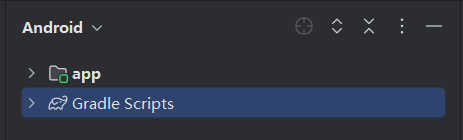

## 一、说明

本文档主要记录了Android项目在文件管理器和Android Studio中的文件结构。

::: demo-wrapper title="参数"
APP名: **fuck**
包 名: **only.fuck.android**
语 言: **kotlin**
其余参数均为默认
:::

## 二、文件结构(文件管理器) 

以下是**初始化完之后**的文件结构：

::: file-tree icon="colored"
  - .idea (包含与IntelliJ IDEA相关的项目配置文件)
    - .gitignore (定义需要Git忽略的文件和文件夹)
    - .name
    - compiler.xml
    - gradle.xml
    - kotlinc.xml
    - migrations.xml
    - misc.xml (IDE的其他配置文件)
    - other.xml
    - workspace.xml (保存IDE的工作空间设置，例如窗口布局)
  - gradle
    - libs.versions.toml
    - wrapper
      - gradle-wrapper.jar
      - gradle-wrapper.properties
  - .gradle (Gradle缓存目录，存储构建期间生成的文件)
    - config.properties (Gradle的配置属性)
    - file-system.probe (检测文件系统特性)
    - 8.7 (Gradle版本相关缓存)
      - gc.properties
      - checksums
        - checksums.lock
        - md5-checksums.bin
        - sha1-checksums.bin
      - dependencies-accessors (依赖访问器缓存)
        - gc.properties
        - e5d0c485ed9081f602aa0c935b664eb63f940590
          - metadata.bin
          - classes
            - org
              - gradle
                - accessors
                  - dm
                    - LibrariesForLibs$AndroidPluginAccessors.class
                    - 此处省略n个文件
                    - LibrariesForLibsInPluginsBlock.class
          - sources
            - org
              - gradle
                - accessors
                  - dm
                    - LibrariesForLibs.java
                    - LibrariesForLibsInPluginsBlock.java
      - executionHistory (构建执行历史记录)
        - executionHistory.lock
      - expanded
      - fileChanges
        - last-build.bin
      - fileHashes (文件的哈希值缓存，便于增量构建)
        - fileHashes.bin
        - fileHashes.lock
        - resourceHashesCache.bin
      - vcsMetadata (版本控制系统元数据)
    - buildOutputCleanup (Gradle构建输出清理相关)
      - buildOutputCleanup.lock
      - cache.properties
    - kotlin (存储Kotlin相关缓存)
      - errors
    - vcs-1
      - gc.properties
  - app (存储应用程序的代码和资源)
    - .gitignore (定义需要Git忽略的文件和文件夹)
    - build.gradle.kts (项目级别或模块级别的Gradle构建脚本，使用Kotlin DSL配置)
    - proguard-rules.pro (配置ProGuard规则，用于代码混淆)
    - src (存储主模块的代码和资源)
      - androidTest (存储设备测试代码)
        - java (存储Java/Kotlin代码文件)
          - only
            - fuck
              - android
                - ExampleInstrumentedTest.kt (示例设备测试代码)
      - main (存储应用程序主代码和资源)
        - AndroidManifest.xml (应用的主配置文件)
        - java (存储Java/Kotlin代码文件)
          - only
            - fuck
              - android
        - res (资源文件，包括图片、布局、字符串等)
          - drawable (存储矢量或普通图片资源)
            - ic_launcher_background.xml
            - ic_launcher_foreground.xml
          - mipmap-anydpi (适配不同屏幕密度的应用图标资源)
            - ic_launcher.xml
            - ic_launcher_round.xml
          - mipmap-hdpi
            - ic_launcher.webp
            - ic_launcher_round.webp
          - mipmap-mdpi
            - ic_launcher.webp
            - ic_launcher_round.webp
          - mipmap-xhdpi
            - ic_launcher.webp
            - ic_launcher_round.webp
          - mipmap-xxhdpi
            - ic_launcher.webp
            - ic_launcher_round.webp
          - mipmap-xxxhdpi
            - ic_launcher.webp
            - ic_launcher_round.webp
          - values (定义常量资源，例如颜色、字符串和主题)
            - colors.xml (定义颜色资源)
            - strings.xml (定义字符串资源)
            - themes.xml (定义应用主题)
          - values-night
            - themes.xml (定义应用主题)
          - xml (存储配置文件，如备份和数据提取规则)
            - backup_rules.xml
            - data_extraction_rules.xml
      - test (存储单元测试代码)
        - java (存储Java/Kotlin代码文件)
          - only
            - fuck
              - android
                - ExampleUnitTest.kt (示例单元测试代码)
  - .gitignore (定义需要Git忽略的文件和文件夹)
  - build.gradle.kts (项目级别或模块级别的Gradle构建脚本，使用Kotlin DSL配置)
  - gradle.properties (配置Gradle的全局属性，例如内存设置和自定义属性)
  - gradlew (Gradle Wrapper脚本，用于跨平台使用指定版本的Gradle)
  - gradlew.bat (Windows系统用的Gradle Wrapper脚本)
  - local.properties (存储本地SDK路径等不应提交到版本控制的信息)
  - settings.gradle.kts (指定项目的模块结构和包含的子项目)
:::

## 三、文件结构(Android Studio) 

**结构总览**：
::: demo-wrapper img no-padding

:::

**app**：
::: demo-wrapper img no-padding

:::

**Gradle Scripts**：
::: demo-wrapper img no-padding

:::
