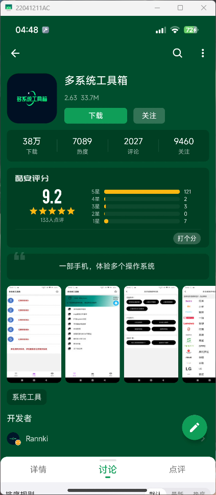
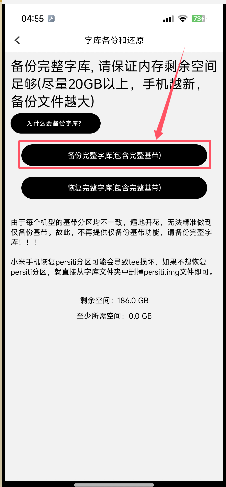
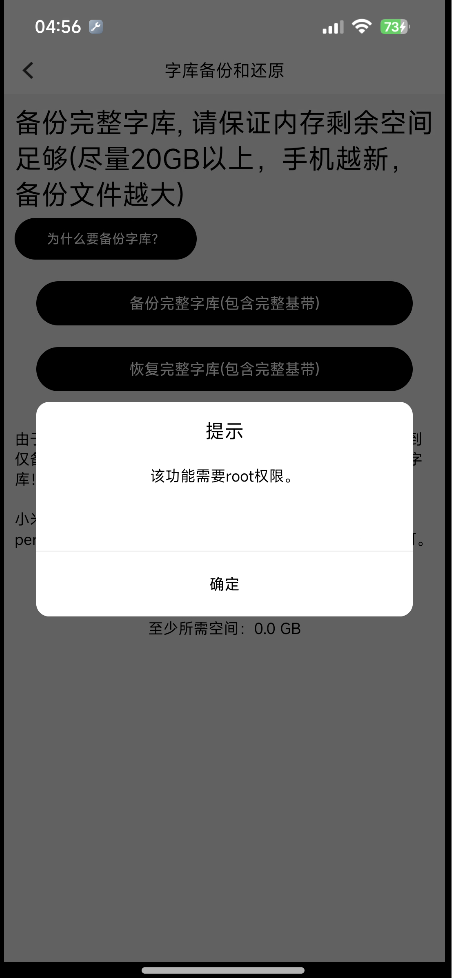
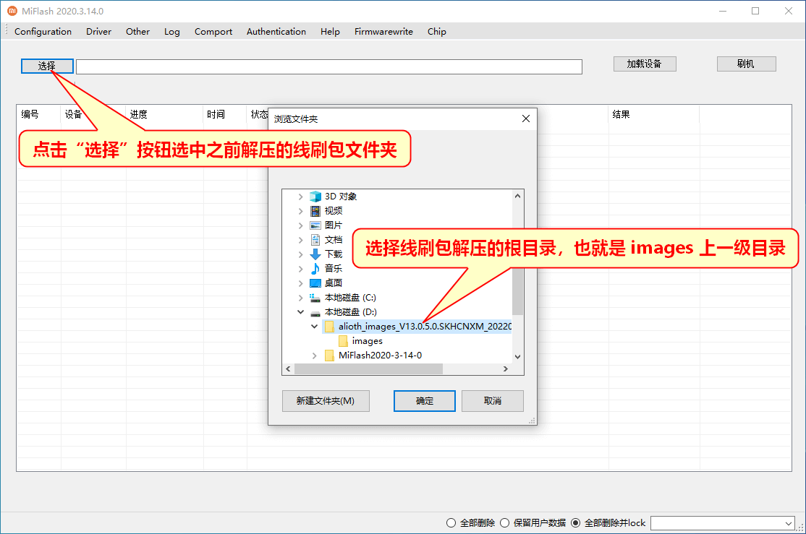
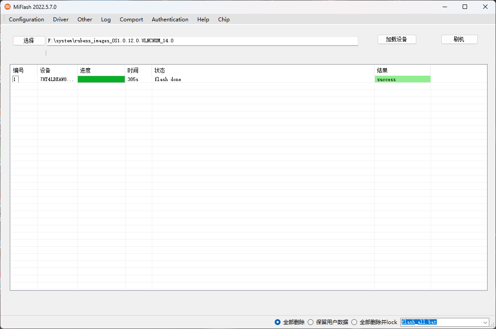

## 前言

由于一些需要，要对我的Root的K50进行**重新刷机、重新Root**，所以记录一下这个过程。
**因为已经Root了，BL锁已经解开了，就不解锁了。**
参考资料：[小米手机线刷方式刷机指南](https://miuiver.com/how-to-flash-xiaomi-phone/)

## 一、下载对应的ROM(系统)

本次刷机使用的是最新的**Redmi K50**的**HyperOS**的**OS1.0.12.0.ULNCNXM**版本的**线刷包**。
下载链接：  [卡刷包](https://bkt-sgp-miui-ota-update-alisgp.oss-ap-southeast-1.aliyuncs.com/OS1.0.12.0.ULNCNXM/miui_RUBENS_OS1.0.12.0.ULNCNXM_f5426b2ac2_14.0.zip)  [线刷包](https://bkt-sgp-miui-ota-update-alisgp.oss-ap-southeast-1.aliyuncs.com/OS1.0.12.0.ULNCNXM/rubens_images_OS1.0.12.0.ULNCNXM_20241015.0000.00_14.0_cn_cd6ccc1825.tgz)

其余手机或者系统版本可以自行前往[hyperos.fans](https://hyperos.fans/)查看下载（**仅限于小米手机**）

## 二、下载小米线刷工具

前往[小米线刷工具官网](https://xiaomiflashtool.com/),下载[最新版](https://xiaomiflashtool.com/wp-content/uploads/MiFlash20220507.zip)

## 三、字库备份

懂点儿Android都知道要进行一下**字库的备份**，以防万一手机变砖。(截止目前为止我还没刷成砖过，嘻嘻)

下面介绍两种方法备份：

### 下载软件：多系统工具箱
可以去[酷安](https://www.coolapk.com/)下载这个软件:[多系统工具箱](https://www.coolapk.com/apk/com.example.ourom)


安装好之后打开软件，并按照以下步骤进行点击：




**注意**：此功能需要root权限，记得开放一下



完成之后，我们把这个部分的文件存储到**其他地方**（电脑上就行）：


### sh脚本备份字库
```sh
echo "> 此备份脚本：理论高通CPU通用"
echo "> 备份所需时间，取决你的闪存读写速度..."
echo "> 请保证内存剩余空间足够(20GB以上…)"
echo "> 即将开始备份分区..."
echo "> 请不要中断..."
echo "-------------------------------------------------------"
sleep 3
#文件位置初始化
model=$(getprop ro.product.model)
serial_no=$(getprop ro.serialno)
date_str=$(date "+%Y%m%d")
dir_name="/sdcard/${model}_${serial_no}_${date_str}"
if [ ! -d "$dir_name" ]; then
    mkdir -p "$dir_name"
else
    rm -rf "$dir_name/*"
fi
if [ ! -d "$dir_name/images" ]; then
    mkdir "$dir_name/images"
fi
echo "" >> "$dir_name/fastboot.sh"
chmod +x "$dir_name/fastboot.sh"
# 过滤分区列表
exclude_partitions=(
"userdata"
"mmcblk0"
"sda"
"backup"
"sdb"
"sdc"
"sdd"
"sde"
"sdf"
"sdg"
)
fastboot_cmd=""
# 获取分区信息
all_partitions=$(ls /dev/block/bootdevice/by-name/)
for partition in ${all_partitions}
do
    rs="No" 
    for exclude_partition in ${exclude_partitions[@]}
    do
        if [[ "$exclude_partition" == "$partition" ]]; then
            rs="Yes"
            break
        fi
    done
    if [[ "Yes" == "$rs" ]]; then
        continue
    fi
    echo "> 备份【$partition】分区"
    dd if="/dev/block/bootdevice/by-name/$partition" of="$dir_name/images/$partition.img"
    echo ""
    
    fastboot_cmd="${fastboot_cmd}fastboot flash $partition ./images/$partition.img\n"
done
# 输出fastboot命令至文件
echo "$fastboot_cmd" > "$dir_name/fastboot.bat"
fastboot_cmd="# !/usr/bin/env bash\n# encoding: utf-8.0\n\n$fastboot_cmd"
echo "$fastboot_cmd" > "$dir_name/fastboot.sh"
# 信息提示
echo "-------------------------------------------------------"
echo "> 分区备份完毕，所有备份的分区镜像，在$dir_name目录下..."
echo "> fastboot.bat/fastboot.sh为线刷脚本，手机进入fastboot模式后，可在PC端执行线刷"
echo "> fastboot线刷，需要adb工具，请自行百度下载adb工具"
echo "> 修改：酷安 @Quarters"
echo "> 原作者：酷安 @Rannki"
exit 0
```

## 四、开始线刷！

打开小米线刷工具，先改一个配置，把下图中的**CheckPoint**中的全部删掉，然后点击**OK**,要不然一会儿刷完可能会出现红色的提示。

刷机右下角的**全部删除并lock**改为**全部删除**（如果你不想刷完之后锁上BL锁的话）
下面正式开始刷机，先将手机**关机**（建议先退出小米账号），长按音量下键 + 开机键进入 **Fastboot** 模式，用**数据线**连接到电脑。



注：以上三张图来自[小米手机线刷方式刷机指南](https://miuiver.com/how-to-flash-xiaomi-phone/)

## 五、完成！开机！
